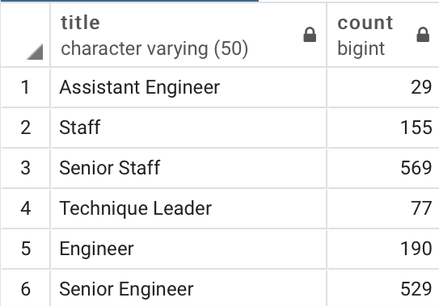

# Pewlett-Hackard-Analysis

We were tasked to provide additional data to management about their expected "silver tsunami" with current employees reaching retirement age. This will enable them to get a clearer picture of where they need to focus their replacements efforts on. Will there be very large specific job titles that will disappear? Is it all management? Using SQL, we can look at the data and answer those questions.
We were also tasked to find eligible mentorship candidates. This will help the company with the transition when people retire. With these insights, the management has an idea of what the future will look like.

I started this project out by creating an ERD (same one from the modules) of 6 CSV files that were provided for us. 

We were tasked to look at several pieces of data. This included the following information: Employee #, first and last names, titles, from_date, and salary. Looking at the ERD, we can see that we need to pull data from 3 different CSV files: employees, titles, and salaries. We then create a database for all people born between 1952-01-01 and 1955-12-31 using 2 inner join functions. This output gives us data that is not fully accurate. The amount of people this has filtered down to is 133,776.  This data still includes duplicate names from people that have changed job titles. We then use partitioning to only show the most recent data for job titles. This filters the data down to 90,398. However, this data is still not complete as it does not take into account people that have left, retired, or died. We need to check for current employees only. I believe that there were many unnecessary extra steps that were required to complete this portion of the assignment. Instead of filtering down the data in multiple steps, we could have just changed the parameters in the initial file by adding the bottom line

This would have given us the results we wanted, without having to drop all the older titles. This also only gives us current employees. I have changed my code so that the data flows better, but have still left the partitioning part in there as per instructions for the module. The partitioning will serve no purpose as there is no need for it anymore. I then created a CSV file to show how many people per title are retiring, and also another CSV that shows the number of titles retiring (this is redundant as the information is easily seen in the CSV for how many people are retiring per title. This would only be useful if there were many more titles). We then created a table that included the mentorship eligible employees. Again, I bypassed a step by adding the to_date filter in the very beginning. This shows us that amount of people that are eligible in a CSV called mentorship. I also showed what titles that the prospective mentorship employees have.

Results:
The firm has currently 240,124 people working for them with 72,458 (30%) of them nearing retirement. This is a substantial amount that needs to be addressed of the company wants to keep on functioning. There are seven different types of titles that will retire:

Below is the breakdown of the titles. As you can see, senior engineer and senior staff are the two largest title groups encompassing of over 70% of the retirees. This is the main focus will have to be.

We also found 1,549 eligible current employees for the mentorship programs. Their titles are displayed below:

I think there is room in improvement for looking at the mentorship program. Why are we only looking at a specific birth year? What bearing does this have on whether someone should be a mentor? Only about 1,500 employees qualified for over 72,000 potential openings. How do we know that these retiring employees are even qualified to mentor. In large companies, a lot of people coast through their careers and may not be suitable to be there. We can also look to see which younger employees should be mentored. We can look at some performance metrics for each employee, after they have reached a certain tenure. This will ensure that we are picking loyal qualified people to mentor for leadership positions. I would also look at the salary impacts that will happen when people will retire. How efficient were these employees? Do we need to replace everyone? Is there fat that we can trim? Maybe we only need to replace 30,000 due to advances in technologies and synergies. This could have a major impact on how the company is run. 
